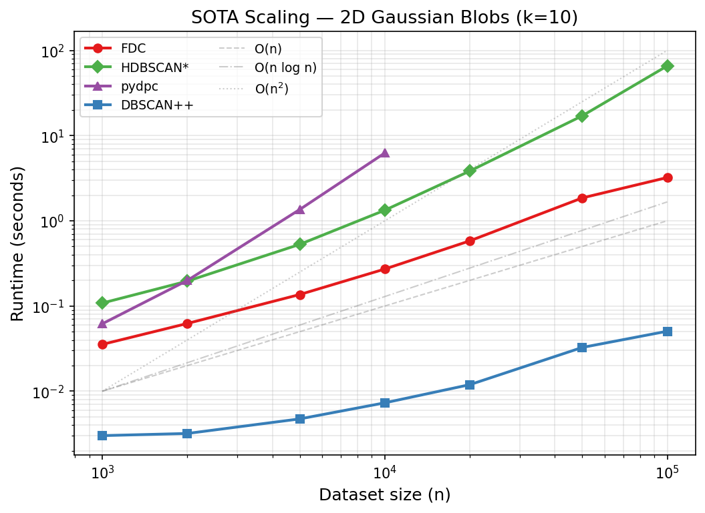

# Benchmarks

Rigorous benchmarks for evaluating FDC against other density-based clustering
algorithms.  Two benchmark scripts cover **clustering quality** and
**scalability**.

## Quick start

```bash
# Install the project with benchmark dependencies
uv pip install -e ".[benchmark]"

# Run quality benchmark (all dataset suites)
uv run python benchmarks/benchmark_quality.py

# Run scaling benchmark
uv run python benchmarks/benchmark_scaling.py
```

---

## 1. Quality benchmark (`benchmark_quality.py`)

Compares **ARI** (Adjusted Rand Index) and **AMI** (Adjusted Mutual
Information) across three dataset suites.

### Algorithms

| Algorithm | Implementation |
|-----------|---------------|
| FDC | `fdc.FDC` (this package) |
| DBSCAN | `sklearn.cluster.DBSCAN` |
| HDBSCAN | `sklearn.cluster.HDBSCAN` |
| OPTICS | `sklearn.cluster.OPTICS` |
| MeanShift | `sklearn.cluster.MeanShift` |

### Dataset suites

**sklearn** — classic toy datasets (n=1500 each, 2D):

| Dataset | Clusters | Challenge |
|---------|----------|-----------|
| circles | 2 | Concentric non-convex rings |
| moons | 2 | Interleaving crescents |
| blobs | 3 | Isotropic Gaussians (easy baseline) |
| aniso | 3 | Elongated / anisotropic clusters |
| varied | 3 | Different cluster densities |

**sipu** — Fränti & Sieranoja shape datasets (2D):

| Dataset | n | Clusters | Challenge |
|---------|---|----------|-----------|
| jain | 373 | 2 | Two crescents, different densities |
| compound | 399 | 6 | Uneven density, nested clusters |
| aggregation | 788 | 7 | Arbitrary shapes, touching |
| pathbased | 300 | 3 | Ring + Gaussian, non-convex |
| spiral | 312 | 3 | Interleaving spirals |
| flame | 240 | 2 | Flame shape, touching |
| d31 | 3100 | 31 | Dense overlapping Gaussians |
| r15 | 600 | 15 | Well-separated Gaussians |
| unbalance | 6500 | 8 | Very unequal cluster sizes |

**fcps** — Fundamental Clustering Problems Suite (Ultsch, 2D/3D):

| Dataset | n | Dim | Clusters | Challenge |
|---------|---|-----|----------|-----------|
| atom | 800 | 3 | 2 | Spherical envelope around inner cluster |
| chainlink | 1000 | 3 | 2 | Two interlocking 3D rings |
| lsun | 400 | 2 | 3 | Different sizes and shapes |
| target | 770 | 2 | 6 | Concentric rings + outliers |
| twodiamonds | 800 | 2 | 2 | Touching diamond shapes |
| wingnut | 1016 | 2 | 2 | Touching wing-nut shapes |
| hepta | 212 | 3 | 7 | Well-separated 3D Gaussians |

Data is loaded on-the-fly from the [Gagolewski clustering-benchmarks
suite](https://clustering-benchmarks.gagolewski.com) via the
`clustering-benchmarks` Python package (no manual download needed).

### Metrics

| Metric | Range | Why |
|--------|-------|-----|
| **ARI** (Adjusted Rand Index) | [-1, 1] | Chance-adjusted, symmetric, most widely reported in the density-clustering literature |
| **AMI** (Adjusted Mutual Information) | [-1, 1] | Chance-adjusted, information-theoretic complement to ARI |

Both metrics equal 1.0 for a perfect clustering match and 0.0 (in
expectation) for a random assignment.  **Best score per row is marked
with \*.**

### Results

#### sklearn (n=1500 each, 2D)

| Dataset | n | k | FDC | DBSCAN | HDBSCAN | OPTICS | MeanShift |
|---------|--:|--:|----:|-------:|--------:|-------:|----------:|
| circles | 1500 | 2 | **1.000** | **1.000** | **1.000** | 0.173 | 0.010 |
| moons | 1500 | 2 | **1.000** | **1.000** | **1.000** | 0.979 | 0.463 |
| blobs | 1500 | 3 | **1.000** | **1.000** | **1.000** | **1.000** | **1.000** |
| aniso | 1500 | 3 | **0.998** | 0.000 | 0.932 | 0.877 | 0.528 |
| varied | 1500 | 3 | 0.943 | 0.000 | 0.842 | **0.961** | 0.840 |
| **MEAN** | | | **0.988** | 0.600 | 0.955 | 0.798 | 0.568 |

#### sipu (2D shape datasets)

| Dataset | n | k | FDC | DBSCAN | HDBSCAN | OPTICS | MeanShift |
|---------|--:|--:|----:|-------:|--------:|-------:|----------:|
| jain | 373 | 2 | 0.000 | 0.932 | **0.936** | 0.104 | 0.343 |
| compound | 399 | 6 | 0.782 | **0.812** | 0.787 | 0.498 | 0.722 |
| aggregation | 788 | 7 | 0.912 | 0.734 | 0.734 | **0.976** | 0.587 |
| pathbased | 300 | 3 | 0.410 | -0.002 | 0.072 | 0.067 | **0.473** |
| spiral | 312 | 3 | 0.952 | **1.000** | 0.158 | 0.138 | -0.003 |
| flame | 240 | 2 | **0.950** | 0.939 | 0.364 | 0.882 | 0.413 |
| d31 | 3100 | 31 | 0.281 | 0.004 | **0.440** | 0.166 | 0.104 |
| r15 | 600 | 15 | 0.329 | 0.264 | 0.264 | **0.974** | 0.264 |
| unbalance | 6500 | 8 | **1.000** | 1.000 | 1.000 | 0.981 | 1.000 |
| **MEAN** | | | 0.624 | 0.631 | 0.528 | 0.532 | 0.434 |

#### fcps (2D/3D fundamental clustering problems)

| Dataset | n | k | FDC | DBSCAN | HDBSCAN | OPTICS | MeanShift |
|---------|--:|--:|----:|-------:|--------:|-------:|----------:|
| atom | 800 | 2 | 0.801 | 0.782 | **1.000** | 0.795 | 0.544 |
| chainlink | 1000 | 2 | 0.390 | **1.000** | **1.000** | 0.058 | 0.000 |
| lsun | 400 | 3 | 0.576 | **0.992** | 0.912 | 0.257 | 0.583 |
| target | 770 | 6 | 0.734 | **1.000** | **1.000** | 0.694 | 0.631 |
| twodiamonds | 800 | 2 | 0.000 | 0.000 | 0.650 | 0.840 | **1.000** |
| wingnut | 1016 | 2 | **1.000** | 0.000 | 0.488 | 0.011 | 0.339 |
| hepta | 212 | 7 | **1.000** | 0.306 | **1.000** | 0.602 | 0.000 |
| **MEAN** | | | 0.643 | 0.583 | **0.864** | 0.465 | 0.442 |

#### Overall (mean ARI across all 21 datasets)

| | FDC | DBSCAN | HDBSCAN | OPTICS | MeanShift |
|--|----:|-------:|--------:|-------:|----------:|
| **Mean ARI** | 0.717 | 0.608 | **0.742** | 0.573 | 0.469 |
| **Mean AMI** | 0.780 | 0.645 | **0.802** | 0.663 | 0.530 |

#### Runtime (seconds, lower is better)

| Dataset | n | FDC | DBSCAN | HDBSCAN | OPTICS | MeanShift |
|---------|--:|----:|-------:|--------:|-------:|----------:|
| circles | 1500 | 0.082 | **0.007** | 0.019 | 0.875 | 0.126 |
| moons | 1500 | 0.074 | **0.008** | 0.019 | 0.869 | 0.098 |
| blobs | 1500 | 0.109 | **0.014** | 0.017 | 0.854 | 0.105 |
| aniso | 1500 | 0.076 | **0.008** | 0.018 | 0.880 | 0.207 |
| varied | 1500 | 0.103 | **0.011** | 0.017 | 0.878 | 0.166 |
| jain | 373 | 0.014 | **0.002** | 0.003 | 0.219 | 0.111 |
| compound | 399 | 0.015 | **0.002** | 0.003 | 0.220 | 0.058 |
| aggregation | 788 | 0.033 | **0.004** | 0.008 | 0.520 | 0.069 |
| pathbased | 300 | 0.011 | **0.001** | 0.002 | 0.172 | 0.047 |
| spiral | 312 | 0.011 | **0.001** | 0.002 | 0.230 | 0.086 |
| flame | 240 | 0.006 | **0.001** | 0.002 | 0.142 | 0.086 |
| d31 | 3100 | 0.171 | **0.018** | 0.104 | 2.152 | 0.160 |
| r15 | 600 | 0.043 | **0.004** | 0.006 | 0.353 | 0.024 |
| unbalance | 6500 | 1.056 | **0.153** | 0.192 | 4.821 | 0.250 |
| atom | 800 | 0.039 | **0.007** | 0.008 | 0.455 | 0.182 |
| chainlink | 1000 | 0.051 | **0.006** | 0.013 | 0.689 | 0.041 |
| lsun | 400 | 0.014 | **0.002** | 0.003 | 0.269 | 0.047 |
| target | 770 | 0.037 | **0.004** | 0.007 | 0.464 | 0.046 |
| twodiamonds | 800 | 0.028 | **0.003** | 0.006 | 0.478 | 0.115 |
| wingnut | 1016 | 0.045 | **0.005** | 0.010 | 0.583 | 0.110 |
| hepta | 212 | 0.007 | **0.001** | 0.002 | 0.124 | 0.028 |
| **MEAN** | | 0.099 | **0.012** | 0.022 | 0.821 | 0.103 |

### Visual comparison


Each row is a dataset, each column is an algorithm. Points are colored by
predicted cluster label (gray = noise). ARI score shown above each panel.

### Usage

```bash
# All suites
uv run python benchmarks/benchmark_quality.py

# Single suite
uv run python benchmarks/benchmark_quality.py --suite sipu

# Tables only (no PNG)
uv run python benchmarks/benchmark_quality.py --no-plot
```

---

## 2. Scaling benchmark (`benchmark_scaling.py`)

Measures **wall-clock runtime** and **peak memory** as dataset size grows from
1,000 to 100,000 points (2D Gaussian blobs, k=10).

Each (algorithm, size) pair is run multiple times; the **median** is reported.

OPTICS is skipped for n > 20,000 because its O(n^2) complexity makes it
impractically slow at larger scales.

### Metrics

| Metric | How measured |
|--------|-------------|
| **Runtime** | `time.perf_counter()` wall-clock (median of trials) |
| **Peak memory** | `tracemalloc` peak allocation in MiB (median of trials) |

### Usage

```bash
# Default (3 trials per point)
uv run python benchmarks/benchmark_scaling.py

# More trials for more stable medians
uv run python benchmarks/benchmark_scaling.py --trials 5

# Tables only
uv run python benchmarks/benchmark_scaling.py --no-plot
```

**Output:** printed tables + `benchmarks/benchmark_scaling.png` (log-log plot
of runtime vs n, with O(n), O(n log n), O(n^2) reference lines).

---

## 3. SOTA comparison (`benchmark_sota.py`)

Compares FDC against **modern density-based clustering methods** on the same
21 datasets.  Each algorithm gets a fair parameter sweep; the best ARI per
dataset is reported.  Runtime is a single re-run with the best parameters.

### Algorithms

| Algorithm | Implementation | Sweep |
|-----------|---------------|-------|
| FDC | `fdc.FDC` (Rust backend) | `eta` ∈ {0.1 … 0.9} |
| HDBSCAN* | `sklearn.cluster.HDBSCAN` | `min_cluster_size` ∈ {5 … 100} |
| pydpc | Rodriguez & Laio 2014 | 48 combos (fraction × density_t × delta_t) |
| DBSCAN++ | Jang et al. | 72 combos (p × eps × minPts) |

### Results (ARI, best over sweep)

#### sklearn

| Dataset | n | k | FDC | HDBSCAN* | pydpc | DBSCAN++ |
|---------|--:|--:|----:|---------:|------:|---------:|
| circles | 1500 | 2 | **1.000** | **1.000** | 0.185 | 0.019 |
| moons | 1500 | 2 | **1.000** | **1.000** | **1.000** | 0.581 |
| blobs | 1500 | 3 | **1.000** | **1.000** | **1.000** | 0.986 |
| aniso | 1500 | 3 | **0.998** | 0.932 | **0.998** | 0.417 |
| varied | 1500 | 3 | 0.930 | 0.868 | **0.934** | 0.851 |
| **MEAN** | | | **0.986** | 0.960 | 0.823 | 0.571 |

#### sipu

| Dataset | n | k | FDC | HDBSCAN* | pydpc | DBSCAN++ |
|---------|--:|--:|----:|---------:|------:|---------:|
| jain | 373 | 2 | 0.747 | **0.936** | 0.686 | 0.231 |
| compound | 399 | 6 | 0.740 | **0.811** | 0.740 | 0.468 |
| aggregation | 788 | 7 | 0.912 | 0.841 | **0.916** | 0.297 |
| pathbased | 300 | 3 | 0.507 | **0.643** | 0.582 | 0.085 |
| spiral | 312 | 3 | **1.000** | 0.939 | **1.000** | 0.000 |
| flame | 240 | 2 | 0.967 | 0.615 | **1.000** | 0.000 |
| d31 | 3100 | 31 | **0.940** | 0.517 | 0.938 | 0.159 |
| r15 | 600 | 15 | **0.993** | 0.944 | **0.993** | 0.054 |
| unbalance | 6500 | 8 | **1.000** | **1.000** | **1.000** | 0.127 |
| **MEAN** | | | 0.867 | 0.805 | **0.873** | 0.158 |

#### fcps

| Dataset | n | k | FDC | HDBSCAN* | pydpc | DBSCAN++ |
|---------|--:|--:|----:|---------:|------:|---------:|
| atom | 800 | 2 | 0.325 | **1.000** | 0.599 | 0.334 |
| chainlink | 1000 | 2 | 0.654 | **1.000** | 0.500 | 0.259 |
| lsun | 400 | 3 | 0.789 | **0.995** | 0.662 | 0.419 |
| target | 770 | 6 | 0.970 | **1.000** | 0.670 | 0.006 |
| twodiamonds | 800 | 2 | 0.990 | 0.661 | 0.990 | **1.000** |
| wingnut | 1016 | 2 | **1.000** | 0.957 | **1.000** | 0.344 |
| hepta | 212 | 7 | **1.000** | **1.000** | **1.000** | 0.099 |
| **MEAN** | | | 0.818 | **0.945** | 0.774 | 0.351 |

#### Overall

| | FDC | HDBSCAN* | pydpc | DBSCAN++ |
|--|----:|---------:|------:|---------:|
| **Mean ARI** | 0.879 | **0.888** | 0.828 | 0.321 |
| **Mean AMI** | 0.887 | **0.896** | 0.858 | 0.381 |

**Key findings:**
- **FDC and HDBSCAN\*** are the top two methods overall (0.879 vs 0.888 mean ARI).
- **FDC leads on 2D datasets** (0.986 mean ARI on sklearn, competitive on sipu)
  and excels on many-cluster problems (d31, r15, spiral, unbalance).
- **HDBSCAN\* leads on 3D datasets** (atom, chainlink) where FDC's density
  estimation is less effective.
- **pydpc** (original density peaks) is competitive on 2D data but limited by
  O(n²) memory.
- **DBSCAN++** trades quality for speed — coreset sampling yields only 0.321
  mean ARI despite 72-combo sweep.

### Usage

```bash
uv pip install pydpc dbscanpp   # optional SOTA deps
uv run python benchmarks/benchmark_sota.py
uv run python benchmarks/benchmark_sota.py --suite sklearn --no-plot
```

---

## 4. SOTA scaling (`benchmark_sota_scaling.py`)

Runtime and peak memory from 1K to 100K points (2D Gaussian blobs, k=10) with
fixed parameters.  pydpc is capped at 10K due to O(n²) memory.

### Runtime (seconds, median of 3 trials)

| n | FDC | HDBSCAN* | pydpc | DBSCAN++ |
|--:|----:|---------:|------:|---------:|
| 1,000 | 0.035 | 0.108 | 0.062 | **0.003** |
| 2,000 | 0.062 | 0.196 | 0.199 | **0.003** |
| 5,000 | 0.136 | 0.529 | 1.357 | **0.005** |
| 10,000 | 0.271 | 1.330 | 6.244 | **0.007** |
| 20,000 | 0.582 | 3.838 | — | **0.012** |
| 50,000 | 1.855 | 17.055 | — | **0.033** |
| 100,000 | 3.220 | 65.763 | — | **0.051** |

### Peak memory (MiB)

| n | FDC | HDBSCAN* | pydpc | DBSCAN++ |
|--:|----:|---------:|------:|---------:|
| 1,000 | 1.1 | 0.5 | 7.7 | **0.0** |
| 10,000 | 11.0 | 4.7 | 763.4 | **0.4** |
| 100,000 | 126.5 | 46.8 | — | **3.7** |

### Scaling summary

| Algorithm | Time | Memory | Notes |
|-----------|------|--------|-------|
| **FDC** | ~O(n log n) | O(n·k) | k-NN via KD-tree (60% of runtime) |
| **HDBSCAN\*** | ~O(n²) | O(n) | Mutual reachability graph bottleneck |
| **pydpc** | O(n²) | O(n²) | Full distance matrix; impractical past 10K |
| **DBSCAN++** | ~O(n) | O(p·n) | Coreset sampling (p=30%) → near-linear |

**FDC is 20× faster than HDBSCAN\*** at 100K (3.2s vs 65.8s) while achieving
comparable quality (0.879 vs 0.888 mean ARI).



```bash
uv run python benchmarks/benchmark_sota_scaling.py
uv run python benchmarks/benchmark_sota_scaling.py --trials 5 --no-plot
```

---

## References

- Fränti, P. & Sieranoja, S. "K-means properties on six clustering benchmark
  datasets." *Applied Intelligence* 48(12), 2018.
  Dataset repository: https://cs.joensuu.fi/sipu/datasets/
- Ultsch, A. "Clustering with SOM: U\*C." *Proc. Workshop on Self-Organizing
  Maps*, 2005.
- Gagolewski, M. "A Framework for Benchmarking Clustering Algorithms."
  *SoftwareX* 20, 2022. https://clustering-benchmarks.gagolewski.com
- Hubert, L. & Arabie, P. "Comparing partitions." *Journal of Classification*
  2, 1985. (ARI)
- Vinh, Epps & Bailey. "Information Theoretic Measures for Clusterings
  Comparison." *ICML*, 2010. (AMI)
- Rodriguez, A. & Laio, A. "Clustering by fast search and find of density
  peaks." *Science* 344(6191), 2014. (pydpc)
- Jang, J. & Jiang, H. "DBSCAN++: Towards fast and scalable density
  clustering." *ICML*, 2019. (DBSCAN++)
