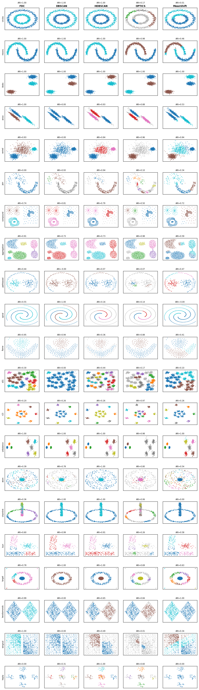

# Benchmarks

Rigorous benchmarks for evaluating FDC against other density-based clustering
algorithms.  Two benchmark scripts cover **clustering quality** and
**scalability**.

## Quick start

```bash
# Install the project with benchmark dependencies
uv pip install -e ".[benchmark]"

# Run quality benchmark (all dataset suites)
uv run python benchmarks/benchmark_quality.py

# Run scaling benchmark
uv run python benchmarks/benchmark_scaling.py
```

---

## 1. Quality benchmark (`benchmark_quality.py`)

Compares **ARI** (Adjusted Rand Index) and **AMI** (Adjusted Mutual
Information) across three dataset suites.

### Algorithms

| Algorithm | Implementation |
|-----------|---------------|
| FDC | `fdc.FDC` (this package) |
| DBSCAN | `sklearn.cluster.DBSCAN` |
| HDBSCAN | `sklearn.cluster.HDBSCAN` |
| OPTICS | `sklearn.cluster.OPTICS` |
| MeanShift | `sklearn.cluster.MeanShift` |

### Dataset suites

**sklearn** — classic toy datasets (n=1500 each, 2D):

| Dataset | Clusters | Challenge |
|---------|----------|-----------|
| circles | 2 | Concentric non-convex rings |
| moons | 2 | Interleaving crescents |
| blobs | 3 | Isotropic Gaussians (easy baseline) |
| aniso | 3 | Elongated / anisotropic clusters |
| varied | 3 | Different cluster densities |

**sipu** — Fränti & Sieranoja shape datasets (2D):

| Dataset | n | Clusters | Challenge |
|---------|---|----------|-----------|
| jain | 373 | 2 | Two crescents, different densities |
| compound | 399 | 6 | Uneven density, nested clusters |
| aggregation | 788 | 7 | Arbitrary shapes, touching |
| pathbased | 300 | 3 | Ring + Gaussian, non-convex |
| spiral | 312 | 3 | Interleaving spirals |
| flame | 240 | 2 | Flame shape, touching |
| d31 | 3100 | 31 | Dense overlapping Gaussians |
| r15 | 600 | 15 | Well-separated Gaussians |
| unbalance | 6500 | 8 | Very unequal cluster sizes |

**fcps** — Fundamental Clustering Problems Suite (Ultsch, 2D/3D):

| Dataset | n | Dim | Clusters | Challenge |
|---------|---|-----|----------|-----------|
| atom | 800 | 3 | 2 | Spherical envelope around inner cluster |
| chainlink | 1000 | 3 | 2 | Two interlocking 3D rings |
| lsun | 400 | 2 | 3 | Different sizes and shapes |
| target | 770 | 2 | 6 | Concentric rings + outliers |
| twodiamonds | 800 | 2 | 2 | Touching diamond shapes |
| wingnut | 1016 | 2 | 2 | Touching wing-nut shapes |
| hepta | 212 | 3 | 7 | Well-separated 3D Gaussians |

Data is loaded on-the-fly from the [Gagolewski clustering-benchmarks
suite](https://clustering-benchmarks.gagolewski.com) via the
`clustering-benchmarks` Python package (no manual download needed).

### Metrics

| Metric | Range | Why |
|--------|-------|-----|
| **ARI** (Adjusted Rand Index) | [-1, 1] | Chance-adjusted, symmetric, most widely reported in the density-clustering literature |
| **AMI** (Adjusted Mutual Information) | [-1, 1] | Chance-adjusted, information-theoretic complement to ARI |

Both metrics equal 1.0 for a perfect clustering match and 0.0 (in
expectation) for a random assignment.  **Best score per row is marked
with \*.**

### Results

#### sklearn (n=1500 each, 2D)

| Dataset | n | k | FDC | DBSCAN | HDBSCAN | OPTICS | MeanShift |
|---------|--:|--:|----:|-------:|--------:|-------:|----------:|
| circles | 1500 | 2 | **1.000** | **1.000** | **1.000** | 0.173 | 0.010 |
| moons | 1500 | 2 | **1.000** | **1.000** | **1.000** | 0.979 | 0.463 |
| blobs | 1500 | 3 | **1.000** | **1.000** | **1.000** | **1.000** | **1.000** |
| aniso | 1500 | 3 | **0.998** | 0.000 | 0.932 | 0.877 | 0.528 |
| varied | 1500 | 3 | 0.930 | 0.000 | 0.842 | **0.961** | 0.840 |
| **MEAN** | | | **0.986** | 0.600 | 0.955 | 0.798 | 0.568 |

#### sipu (2D shape datasets)

| Dataset | n | k | FDC | DBSCAN | HDBSCAN | OPTICS | MeanShift |
|---------|--:|--:|----:|-------:|--------:|-------:|----------:|
| jain | 373 | 2 | 0.000 | 0.932 | **0.936** | 0.104 | 0.343 |
| compound | 399 | 6 | 0.740 | **0.812** | 0.787 | 0.498 | 0.722 |
| aggregation | 788 | 7 | 0.912 | 0.734 | 0.734 | **0.976** | 0.587 |
| pathbased | 300 | 3 | 0.444 | -0.002 | 0.072 | 0.067 | **0.473** |
| spiral | 312 | 3 | 0.409 | **1.000** | 0.158 | 0.138 | -0.003 |
| flame | 240 | 2 | **0.950** | 0.939 | 0.364 | 0.882 | 0.413 |
| d31 | 3100 | 31 | 0.295 | 0.004 | **0.440** | 0.166 | 0.104 |
| r15 | 600 | 15 | 0.553 | 0.264 | 0.264 | **0.974** | 0.264 |
| unbalance | 6500 | 8 | **1.000** | 1.000 | 1.000 | 0.981 | 1.000 |
| **MEAN** | | | 0.589 | 0.631 | 0.528 | 0.532 | 0.434 |

#### fcps (2D/3D fundamental clustering problems)

| Dataset | n | k | FDC | DBSCAN | HDBSCAN | OPTICS | MeanShift |
|---------|--:|--:|----:|-------:|--------:|-------:|----------:|
| atom | 800 | 2 | 0.207 | 0.782 | **1.000** | 0.795 | 0.544 |
| chainlink | 1000 | 2 | 0.364 | **1.000** | **1.000** | 0.058 | 0.000 |
| lsun | 400 | 3 | 0.576 | **0.992** | 0.912 | 0.257 | 0.583 |
| target | 770 | 6 | 0.764 | **1.000** | **1.000** | 0.694 | 0.631 |
| twodiamonds | 800 | 2 | 0.000 | 0.000 | 0.650 | 0.889 | **1.000** |
| wingnut | 1016 | 2 | **1.000** | 0.000 | 0.488 | 0.011 | 0.339 |
| hepta | 212 | 7 | 0.000 | 0.306 | **1.000** | 0.602 | 0.000 |
| **MEAN** | | | 0.416 | 0.583 | 0.864 | 0.472 | 0.442 |

#### Overall (mean ARI across all 21 datasets)

| | FDC | DBSCAN | HDBSCAN | OPTICS | MeanShift |
|--|----:|-------:|--------:|-------:|----------:|
| **Mean ARI** | 0.626 | 0.608 | **0.742** | 0.575 | 0.469 |
| **Mean AMI** | 0.691 | 0.645 | **0.802** | 0.664 | 0.530 |

#### Runtime (seconds, lower is better)

| Dataset | n | FDC | DBSCAN | HDBSCAN | OPTICS | MeanShift |
|---------|--:|----:|-------:|--------:|-------:|----------:|
| circles | 1500 | 0.123 | **0.011** | 0.034 | 1.285 | 0.192 |
| moons | 1500 | 0.089 | **0.009** | 0.020 | 1.183 | 0.142 |
| blobs | 1500 | 0.139 | **0.017** | 0.018 | 1.210 | 0.149 |
| aniso | 1500 | 0.088 | **0.010** | 0.021 | 1.162 | 0.257 |
| varied | 1500 | 0.134 | **0.016** | 0.024 | 1.232 | 0.273 |
| jain | 373 | 0.018 | **0.002** | 0.004 | 0.242 | 0.120 |
| compound | 399 | 0.016 | **0.002** | 0.003 | 0.329 | 0.122 |
| aggregation | 788 | 0.057 | **0.007** | 0.010 | 0.543 | 0.086 |
| pathbased | 300 | 0.011 | **0.001** | 0.002 | 0.215 | 0.051 |
| spiral | 312 | 0.015 | **0.002** | 0.003 | 0.204 | 0.113 |
| flame | 240 | 0.008 | **0.002** | 0.002 | 0.152 | 0.090 |
| d31 | 3100 | 0.178 | **0.018** | 0.102 | 2.404 | 0.156 |
| r15 | 600 | 0.024 | **0.002** | 0.005 | 0.390 | 0.027 |
| unbalance | 6500 | 1.134 | **0.181** | 0.186 | 6.065 | 0.280 |
| atom | 800 | 0.038 | **0.007** | 0.008 | 0.530 | 0.181 |
| chainlink | 1000 | 0.056 | **0.005** | 0.010 | 0.775 | 0.062 |
| lsun | 400 | 0.018 | **0.002** | 0.003 | 0.259 | 0.046 |
| target | 770 | 0.042 | **0.004** | 0.007 | 0.513 | 0.053 |
| twodiamonds | 800 | 0.039 | **0.004** | 0.008 | 0.522 | 0.132 |
| wingnut | 1016 | 0.038 | **0.004** | 0.009 | 0.701 | 0.145 |
| hepta | 212 | 0.008 | **0.001** | 0.003 | 0.130 | 0.032 |
| **MEAN** | | 0.113 | **0.015** | 0.023 | 0.965 | 0.138 |

### Visual comparison



Each row is a dataset, each column is an algorithm. Points are colored by
predicted cluster label (gray = noise). ARI score shown above each panel.

### Usage

```bash
# All suites
uv run python benchmarks/benchmark_quality.py

# Single suite
uv run python benchmarks/benchmark_quality.py --suite sipu

# Tables only (no PNG)
uv run python benchmarks/benchmark_quality.py --no-plot
```

---

## 2. Scaling benchmark (`benchmark_scaling.py`)

Measures **wall-clock runtime** and **peak memory** as dataset size grows from
1,000 to 100,000 points (2D Gaussian blobs, k=10).

Each (algorithm, size) pair is run multiple times; the **median** is reported.

OPTICS is skipped for n > 20,000 because its O(n^2) complexity makes it
impractically slow at larger scales.

### Metrics

| Metric | How measured |
|--------|-------------|
| **Runtime** | `time.perf_counter()` wall-clock (median of trials) |
| **Peak memory** | `tracemalloc` peak allocation in MiB (median of trials) |

### Usage

```bash
# Default (3 trials per point)
uv run python benchmarks/benchmark_scaling.py

# More trials for more stable medians
uv run python benchmarks/benchmark_scaling.py --trials 5

# Tables only
uv run python benchmarks/benchmark_scaling.py --no-plot
```

**Output:** printed tables + `benchmarks/benchmark_scaling.png` (log-log plot
of runtime vs n, with O(n), O(n log n), O(n^2) reference lines).

---

## References

- Fränti, P. & Sieranoja, S. "K-means properties on six clustering benchmark
  datasets." *Applied Intelligence* 48(12), 2018.
  Dataset repository: https://cs.joensuu.fi/sipu/datasets/
- Ultsch, A. "Clustering with SOM: U\*C." *Proc. Workshop on Self-Organizing
  Maps*, 2005.
- Gagolewski, M. "A Framework for Benchmarking Clustering Algorithms."
  *SoftwareX* 20, 2022. https://clustering-benchmarks.gagolewski.com
- Hubert, L. & Arabie, P. "Comparing partitions." *Journal of Classification*
  2, 1985. (ARI)
- Vinh, Epps & Bailey. "Information Theoretic Measures for Clusterings
  Comparison." *ICML*, 2010. (AMI)
